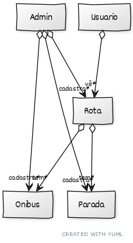

# Documento de Visão

Documento construído a partido do **Modelo BSI - Doc 001 - Documento de Visão** que pode ser encontrado no
link: https://docs.google.com/document/d/1DPBcyGHgflmz5RDsZQ2X8KVBPoEF5PdAz9BBNFyLa6A/edit?usp=sharing

## Equipe e Definição de Papéis

Membro     |     Papel   |   E-mail   |
---------  | ----------- | ---------- |
Gabriel    | Testador, Desenvolvedor  | batistagabriel360@gmail.com
Pedro      | Testador, Desenvolvedor  | pedrojonassm@gmail.com

### Matriz de Competências

Membro     |     Competências   |
---------  | ----------- |
Gabriel    | Testes em Javascript / Typescript, VSCode |
Pedro      | Desenvolvedor Java, Games, Eclipse, VSCode |

## Perfis dos Usuários

O sistema poderá ser utilizado por diversos usuários. Temos os seguintes perfis/atores:

Perfil                                 | Descrição   |
---------                              | ----------- |
Administrador | Este usuário realiza os cadastros base e pode realizar qualquer função.
Padrão | Este usuário pode verificar os horários e rotas de um ónibus, realizar a compra de tickets

## Lista de Requisitos Funcionais

Requisito                                 | Descrição   | Ator |
---------                                 | ----------- | ---------- |
RF001 - Cadastro de Usuário    | Um novo usuário pode realizar um cadastro. Um usuário tem name, id, email, username, data de nascimento, tipo de usuário, status, password, avatarURL, quantidade de tickets | Padrão |
RF002 - Login de Usuário | Um usuário cadastrado pode realizar um login no sistema. Para realizar o login é necessário do username ou email e a password | Padrão |
RF003 - Alterar Usuário | Um usuário cadastrado pode alterar seu próprio username, email ou senha | Padrão |
RF004 - Excluir Usuário | Um usuário cadastrado pode excluir sua própria conta | Padrão |
RF005 - Visualizar detalhes de Usuário | Um usuário pode ver seus próprios dados | Padrão |
RF006 - Visualizar detalhes de um Ônibus | Um usuário pode ver os detalhes de um ônibus, detalhes esses incluem: Rotas, Localização atual, horários de funcionamento, em funcionamento | Padrão |
RF007 - Comprar Tickets | Um usuário pode comprar tickets via o app | Padrão |
RF008 - Visualizar Tickets | Um usuário pode ver quantos tickets tem em sua conta | Padrão |
RF009 - Visualizar Histórico de transporte | Um usuário pode ver seu histórico de transporte de ônibus | Padrão |
RF010 - Cadastro de Ônibus | Um Admin pode cadastrar um Ônibus. Um ônibus tem id, horários de funcionamento, rotas, numero de assentos, numero de passageiros, em funcionamento | Administrador |
RF011 - Alterar Ônibus | Um Admin pode alterar os dados de um ônibus | Administrador |
RF012 - Desativar Ônibus | Um Admin pode desativar um ônibus | Administrador |
RF013 - Excluir Ônibus | Um Admin pode excluir um ônibus | Administrador |
RF014 - Alterar Usuário | Um Admin pode alterar dados de outros usuário | Administrador |
RF015 - Banir Usuário | Um Admin pode banir um usuário. Um usuário banido ficaria por algum tempo sem poder utilizar o sistema, podendo, até mesmo, ser banido permanentemente | Admnistrador |
RF016 - Cadastrar ponto de parada | Um Admin pode cadastrar um novo ponto de parada. Um ponto de parada tem id, localização, referência | Administrador |
RF017 - Alterar ponto de parada | Um Admin pode alterar um ponto de parada | Administrador |
RF018 - Excluir ponto de parada | Um Admin pode excluir um ponto de parada | Administrador |
RF019 - Cadastrar uma rota | Um Admin pode cadastrar uma rota de ônibus. Uma rota teria id, pontos de parada, lista ônibus | Administrador |
RF020 - Alterar uma rota | Um Admin pode Alterar uma rota de ônibus | Administrador |
RF021 - Excluir uma rota | Um Admin pode excluir uma rota de ônibus | Administrador |
RF022 - Ver Rota | Um usuário pode ver os detalhes de uma rota | Padrão |

### Modelo Conceitual

Abaixo apresentamos o modelo conceitual usando o **YUML**.

 

#### Descrição das Entidades

## Lista de Requisitos Não-Funcionais

Requisito                                 | Descrição   |
---------                                 | ----------- |
RNF001 - Deve ser acessível via navegador | Deve abrir perfeitamento em navegadores web |
RNF002 - Consultas deve ser eficiente | O sistema deve executar as consultas em milessegundos |
RNF003 - Log e histórico de acesso e funções | Deve manter um log de todos os acessos e das funções executadas pelo usuário |

## Riscos

Tabela com o mapeamento dos riscos do projeto, as possíveis soluções e os responsáveis.

Data | Risco | Prioridade | Responsável | Status | Providência/Solução |
------ | ------ | ------ | ------ | ------ | ------ |
19/03/2021 | Não aprendizado das ferramentas utilizadas pelos componentes do grupo | Alta | Todos | Vigente | Reforçar estudos sobre as ferramentas e aulas com a integrante que conhece a ferramenta |
19/03/2021 | Software não ficar pronto até a data do cronograma | Alta | Todos | Vigente | Reforçar o cumprimento das tarefas até a data planejada, e manter alguem como gerente para realizar o controle do tempo |
19/03/2021 | Falta de infraestrutura para rodar o software | Alta | Todos | Vigente | Buscar investidores para conseguir maquinas para a execução do software |

### Referências
